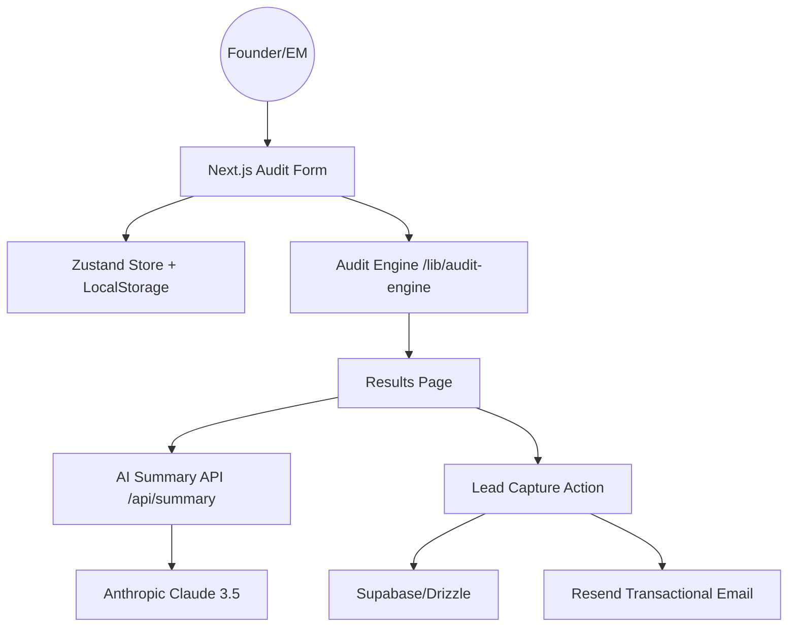

# ARCHITECTURE.md

## System Diagram

## Data Flow
1. **Intake**: User enters their AI stack details. Zustand captures this and persists it to `localStorage`.
2. **Analysis**: The `runAudit` function processes the inputs against a curated set of pricing rules (`/lib/audit-engine/rules.ts`) and alternative mapping (`alternatives.ts`).
3. **Synthesis**: The results are passed to the `/api/summary` route, which prompts Anthropic's Claude 3.5 Sonnet to write a professional executive summary.
4. **Delivery**: The user views the result. Entering an email triggers a server action that stores the lead and sends a summary report via Resend.

## Stack Selection
- **Next.js 16 (App Router)**: For high-performance SSR and server actions.
- **TypeScript**: Essential for maintaining a bug-free audit engine with complex pricing schemas.
- **Tailwind CSS + Framer Motion**: To achieve the "Premium AI Observatory" aesthetic with smooth transitions and high-fidelity typography.
- **Zustand**: Lightweight state management for real-time form-to-result synchronization.
- **Resend**: Modern, developer-friendly transactional email delivery.

## Scaling to 10k Audits/Day
If traffic scaled to 10k/day, I would:
1. **Edge-Based Audit**: Move the audit engine to Edge Functions to reduce latency to <50ms globally.
2. **AI Result Caching**: Cache the AI-generated summaries in Upstash Redis by hashing the audit result. Most audits with the same toolset will yield the same summary.
3. **Async Email Processing**: Move the Resend call to a background worker (e.g., Inngest or Upstash QStash) to ensure the UI remains snappy during lead submission.
