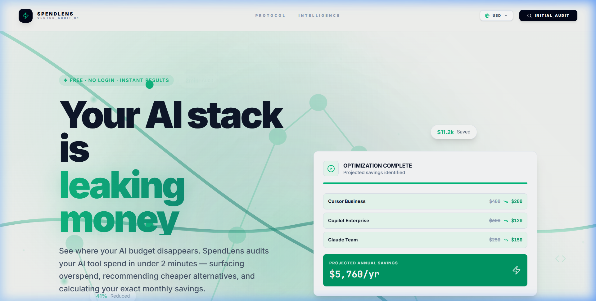

# SpendLens
> AI-powered spend audit for startup engineering teams. Stop overpaying for your AI stack.



## Overview
SpendLens is a free, high-trust fintech-style audit tool designed to surface overspend in a startup's AI toolchain (Cursor, Claude, ChatGPT, etc.). It helps founders recover significant capital by identifying over-provisioned seats, tier mismatches, and cheaper infrastructure alternatives.

## Decisions & Trade-offs
1. **Synchronous Audit Engine**: I chose a rule-based synchronous engine instead of LLM-based audit math. This ensures 100% accuracy and speed (<100ms), which is critical for trust in financial tools.
2. **Post-Value Lead Capture**: Following the "Value First" principle, email capture only happens after the audit is displayed. This increases conversion by proving utility before asking for data.
3. **Template-based AI Fallback**: If the Anthropic API is slow or hits a rate limit, we fall back to a data-driven "Vector Synthesis" template. Better to show a good static summary than an error or loading spinner.
4. **Tailwind for Design Control**: I avoided pre-built admin templates to create a custom "AI Observatory" aesthetic from scratch using Tailwind CSS.
5. **Client-side State Persistence**: Form data is synced to `localStorage` via Zustand to ensure founders don't lose their work if they refresh.

## Quick Start
1. **Clone & Install**:
   ```bash
   git clone https://github.com/RawatAr/SpendLens.git
   cd spendlens
   npm install
   ```
2. **Environment**:
   Copy `.env.local.example` to `.env.local` and add your `ANTHROPIC_API_KEY` and `RESEND_API_KEY`.
3. **Run**:
   ```bash
   npm run dev
   ```

## Live URL
[https://spend-lens-rho.vercel.app/](https://spend-lens-rho.vercel.app/)
